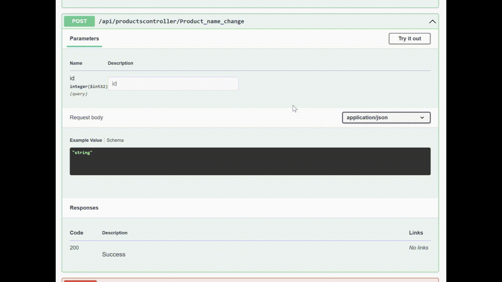

# Pontozólap
Név: Kozári Márton

Neptun: JPIMEP

## Projekt rövid leírása:
Az alkalmazás egy raktár vezetésére, kezelésére szolgál. Lehetőség van Termékeket törölni, módosítani, feltölteni és átnevezni mind a Weboldal és az Forms alkalmazás könnyezetében. A swagger felületen mindezekre szintén van lehetőség, így teljeskörű a hozzáférés.

## Hozott anyagok:
hozott.js
scaffold.txt

##### Saját Adatbázis

)
- `3x1p` Az alkalmazásban használt táblánként pont (Products, Category, Suppliers)
- `1x1p` Az adatbázis tartalmaz Constraint-eket (min 2)
- `1x2p` Az adatbázis saját Azure SQL szerveren van
- `1x1p` Az adatbázis adatainak forrásmegjelölése, miből készült és hogyan:
>Az adatbázis elkészítéséhez ötletként jött a raktározás, hogy mi tud jól működni egy például CRUD rendszerben. Ezt követően az adatbázist elkészítettem az Azure Portal-on, majd rácsatlakoztam az Azure Data Studio-ra és azon keresztül létrehoztam neki a megfelelő táblákat megfelelő megszorításokkal. Ezen tábla adatait ChatGPT segítségével feltöltöttem szintetikus adatokkal. Három táblánk van, a ‘Products’ tábla tartalmaz minden szükséges adatot kulcsokkal, itt hivatkozik a ‘Category’ és ‘Supplier’ táblákra ahol a termék kategóriája és a terméket kiszállító Szállító található.

Részösszeg: `7p`
Összesen: 7p
#### Weboldal

- `1p` A weboldalnak van egy értelmezhető struktúrája
- `1p` A weboldal dinamikus tartalommal tölthető fel adatbázison keresztül
- `1p` A weboldal használ legalább 20 sor értelmes css-t
- `1p` A weboldal javascriptet használ API végpont által szolgáltatott adatok betöltésére, hozott anyagként

Részösszeg: `4p`
Összesen: 11p

## Windows Forms Application

### User Interface
- `1x2p` Kilépés csak megerősítő kérdés után lehetséges.  
- `2x2p` Olyan alkalmazás elrendezés, melyben gombok lenyomására UserControl-ok kerülnek elhelyezésre egy Panel vezérlőben, teljesen kitöltve azt. (Productcontrol, Modifyproduct)

### Tábla adatainak megjelenítése ListBox-ban
- `1x2p` Adatok megjelenítése ListBox-ban
- `2x2p` Ha az adatok tetszőleges módszerrel, pl. TextBox-on keresztül szűrhetőek.

### Tábla adatainak megjelenítése DataGridView-ban
- `1x2p` Adatok megjelenítése DGV-ben  

####User Interface , Daragridview és Tábla megjelenítése Listbox-ban.

### Adatkötés BindingSource-on keresztül
- `1x2p` Működő BindingSource  

### Új rekord rögzítése
- `1x2p` Master-detail reláció detail táblájába új rekord rögzítése (Products details 'CATEGORIES,SUPPLIER' betöltése Include-al )  
- `1x1p` Nem kulcs mező is felvéve (Price, Quantity)  
- `1x2p` Ellenőrzéshez kötött adatfelvitel (String.IsNullOrEmpty stb.)  (ModifyProduct)
- `1x2p` Legördülő dobozon (ComboBox) keresztül beállítható idegen kulcs is (ModifyProduct)
- `1x2p` Felugró ablakon keresztül történik Ok és Mégse gombbal (ModifyProduct)
- `1x1p` Hibás kitöltés esetén nem lehet megynomni az Ok gombot. 
### Rekord törlése
- `1x2p` Sikeres törlés  
- `1x2p` Megerősítéshez kötött törlés  

####<Új rekord és rekord törlés>

### Egyéb, extra
- `2x1p` Scaffold-DbContext használata (Web APi és WIndows Forms)

Részösszeg: `30p`
Összesen: 41p

### ASP .NET 
ASP .NET alkalmazás, melyet lehet a Forms alapú projekttel közös solution-ben létrehozni.

- `1x2p`  `program.cs` beállítása `wwwroot` mappában tárolt statikus tartalmak megosztására

##### API végpontok

A képne látható API végpontok a következőket teljesítik:
- `1x3p` Teljes SQL tábla adatainak szolgáltatása API végponton keresztül
- `1x2p` SQL tábla egy választható rekordjának szolgáltatása API végponton keresztül (Products)
- `1x3p` SQL tábla egy választható rekordjának törlése
- `1x5p` Új rekord felvétele HttpPost metóduson keresztül SQL táblába
- `1x3p` Rekord módosítása HttpPost metóduson keresztül SQL táblában

####<API Végpontok>

Megjelenítjük a lista összes adatát, a kulcsok helyére refferálunk a megfelelő Kategória és Szállító nevével.

Id keresés alapon bekérjük az id-t és kiírjuk a talált Termék adatait, amennyiben van ilyen id.

Új terméket viszünk fel validációval.

Átnevezhetünk egy termék nevét.

Id alapon törölhetjük egy termék teljes adatsorát.

Részösszeg: `16p`
## Összesen 57p

